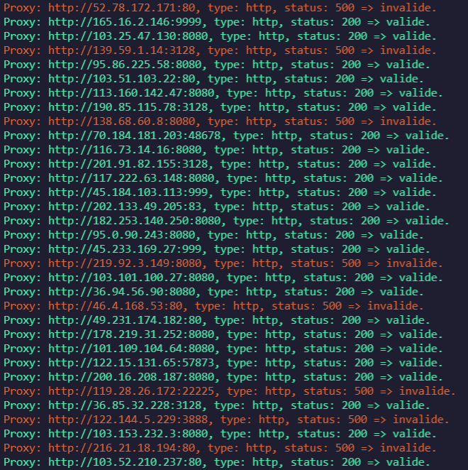

## this module allows you to check proxy.

#### You have as option: "url, type (http, https, socks4, socks5) and a file"


[](https://nodei.co/npm/checker-proxy/)

__exemple__:

JavaScript (_Framework nodejs_)
```js
/*const proxycheck = require('./test')*/
const proxycheck = require('checker-proxy')

let config = {
    type: 'http',
    url: 'https://discord.com/register',
    file: 'file.txt'
}

let l = require('fs').readFileSync('./proxy.txt', 'utf-8').replace(/\r|\"/gi, '').split("\n")
l.forEach(a => {
    proxycheck.check({
        url: config.url,
        type: config.type,
        proxy: a
    }).then(r => {
        if (r.code !== 200) {
            console.info(`\x1b[31mProxy: ${r.proxy}, type: ${r.type}, status: ${r.code} => invalide.\x1b[0m`)
        } else if (r.code == 200) {
            require('fs').appendFileSync(config.file, a + '\n')
            console.info(`\x1b[32mProxy: ${r.proxy}, type: ${r.type}, status: ${r.code} => valide.\x1b[0m`)
        }
    }).catch(e => {
    	//return error
        console.error(e)
        process.exit()
    })
})
```

```js
return {
    proxy: String,
    type: String,
    code: Number
}

/*if error*/
return {
    proxy: String,
    type: String,
    code: { type: Number, default: 500 },
    err: String
}
```
#### Result

